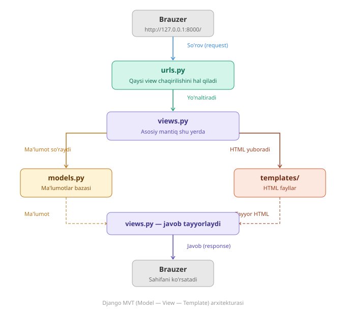

# Django Darslari 🐍

> G'olib Davronov ustozning Django kursi — bitta loyiha ustida bosqichma-bosqich

---

## Loyiha haqida

Bu repoda Django ni o'rganish jarayonida yozilgan barcha kodlar saqlanadi. Har bir yangi mavzu o'rganilgach shu loyihaga qo'shib boriladi.

**O'qituvchi:** G'olib Davronov  
**O'quvchi:** Qodirxon  
**Yo'nalish:** Web Backend (Python / Django)

---

## O'rnatish

```bash
# 1. Reponi yuklab olish
git clone https://github.com/Qodirxon/django_darslari.git
cd django_darslari

# 2. Virtual muhit
python -m venv venv
source venv/bin/activate        # Mac / Linux
venv\Scripts\activate           # Windows

# 3. Kutubxonalarni o'rnatish
pip install -r requirements.txt

# 4. Bazani tayyorlash
python manage.py migrate

# 5. Ishga tushirish
python manage.py runserver
```

Brauzerda oching: `http://127.0.0.1:8000`

---

## O'rganilgan mavzular

- [x] Django o'rnatish, loyiha va app yaratish
- [x] URL va Views
- [x] Templates
- [x] Models va migratsiyalar
- [ ] Django Admin
- [ ] Forms
- [ ] Login / Register
- [ ] Django REST Framework

---

## Texnologiyalar

| | |
|---|---|
| Til | Python 3.12+ |
| Framework | Django 5.x |
| Baza | SQLite |

---


## Django MVT arxitekturasi




## Litsenziya

MIT — o'quv maqsadida erkin foydalaning.

---

<div align="center">
  <sub>O'zbekiston 🇺🇿 · Qodirxon tomonidan</sub>
</div>
